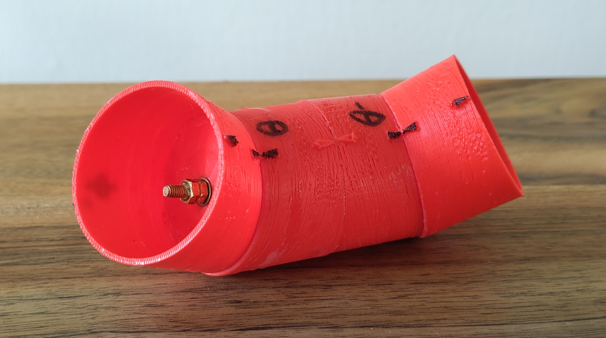
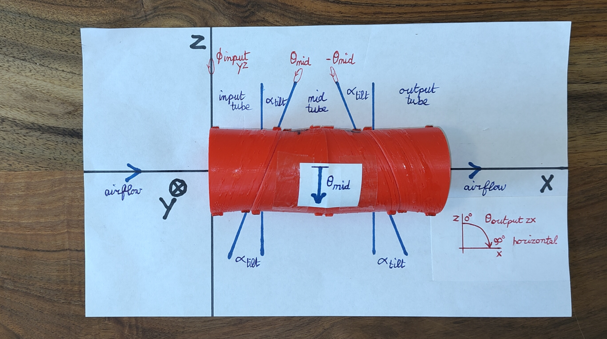
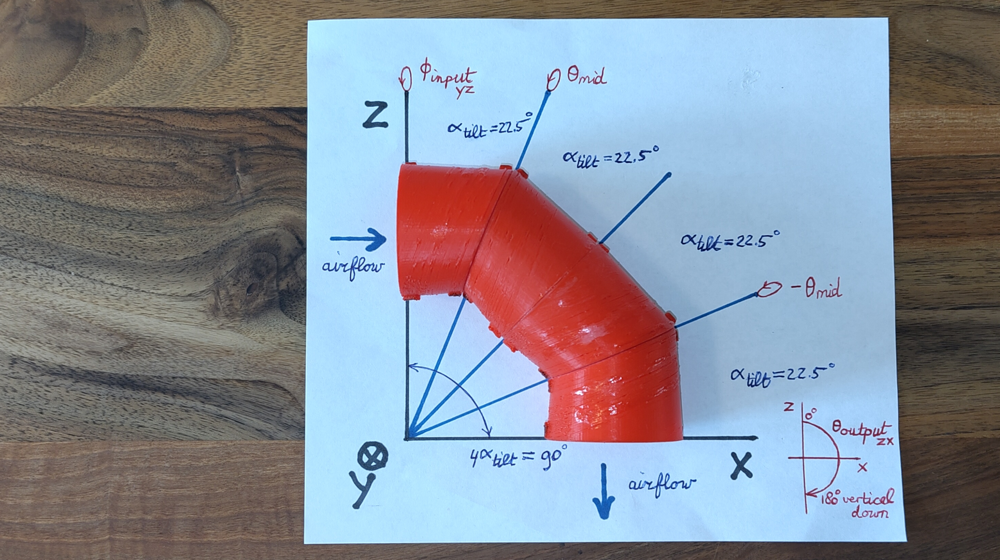
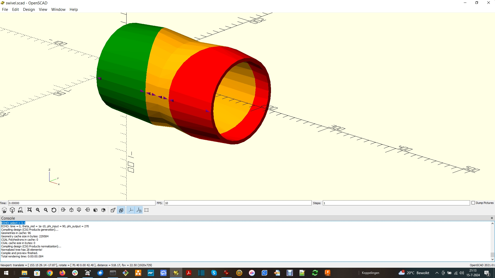
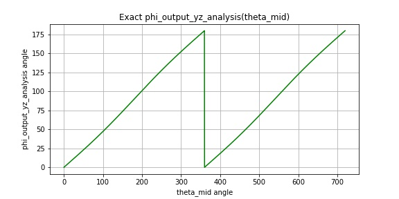
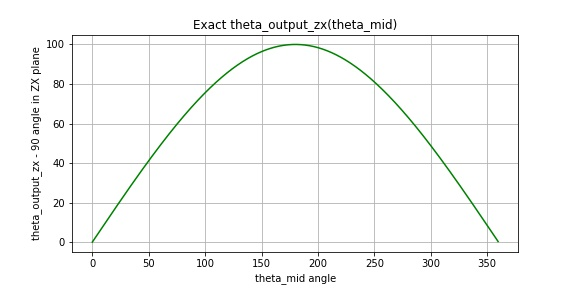

# Model and animation of an F35B airplane swivel in OpenSCAD

For a video with animations of the swivel and more information please also check my channel "Eric Kooistra - Hobby" on YouTube: https://www.youtube.com/@EricKooistra-Hobby

## 1 3D-printed swivel model
The swivel model consists of four identical tube segments, one as input tube, two for the mid tube, and one as output tube. After 3D printing, the two segments for the mid tube are glued together and then bolted to the input segment and to the output segment. The bolts should be so tight that the tubes maintain their position, but can be rotated manually.



Figure 1: 3D printed swivel model

## 2 Swivel model definitions
The swivel is at the tail of an airplane. The airplane is oriented with up in positive Z direction and right in positive Y direction. For forward flight the airplane flies in negative X direction, and the swivel thrust vector points horizontal in positive X direction.



Figure 2.1: Straight swivel for forward flight

The alpha_tilt angle beteen the tube segments yields a maximum pointing range of 0 to 4 * alpha_tilt degrees, when the mid tube is rotated by theta_mid = 0 to 180 degrees. For alpha_tilt > 22.5 degrees the swivel output can be pointed slightly forward as well, which makes it possible to use the swivel for pitch control during hovering.



Figure 2.2: Tilted swivel for hover flight

The swivel is also called 3-bearing swivel nozzle or 3-bearing swivel module (BSM), because it has three bearings: one bearing to rotate the input tube with respect to the fuselage, one bearing to rotate the mid tube with respect to the input tube and one bearing to rotate the output tube with respect to the mid tube.

### 2.1 Coordinates and angles
The XYZ coordinates and corresponding zero angle and positive angle directions are defined as:
```
From https://github.com/erkooi/openscad/libraries/linear_algebra.scad:

* Right-handed coordinates X, Y, Z:
  . right hand fingers point from X to Y points tumb to Z
  . screw from X to Y goes to Z

      z
      |          . angleYZ
      |--- y     . angleZX
     /           . angleXY
    x

* Euler angles
  - https://en.wikipedia.org/wiki/Euler_angles
  - positive rotation about:
    . X-axis from Y to Z = phi, is roll, aileron, banking
    . Y-axis from Z to X = theta, is pitch, elevator, elevation
    . Z-axis from X to Y = psi, is yaw, rudder, heading

* Spherical coordinates P(r, phi, theta)
  - https://en.wikipedia.org/wiki/Spherical_coordinate_system
    . r is radial distance from origin to P
    . phi is angle from X to projection of P in XY plane
    . theta is angle from Z to radial line through P
```

## 3 Swivel control
### 3.1 Input tube rotation (phi_input_yz)
The input tube rotates in the YZ plane. The input tube YZ angle phi_input_yz therefore also directly affects the YZ angle phi_output_yz of the swivel output.

### 3.2 Mid tube rotation (theta_mid)
The mid tube rotates in the tilted plane with the input tube and the output tube rotates in the tilted plane with the mid tube, whereby these rotations are equal but in opposite directions. Thanks to these opposite rotations of the mid tube, all three tubes of the swivel always remain in a common plane, so the swivel output pointing is the same as the pointing of the output tube. The swivel is straight when the angle between the mid tube and the input tube is theta_mid = 0. The swivel is maximum tilted when theta_mid = 180 degrees. Hence the mid tube rotation determines the off center XR angle theta_output_xr between the X-axis and the swivel output pointing.

#### 3.2.1 Counter rotation of input tube
When the mid tube is rotated, then the swivel output also rotates in the YZ plane. To keep the swivel thrust vector pointing of theta_output_xr in a fixed plane, typically the ZX plane, it is therefore necessary to compensate for this side effect by counter rotating the input tube via phi_input_yz. The counter rotation via phi_input_yz then ensures that phi_output_yz remains at 270 degrees when the swivel output is moved between horizontal and maximum tilted down in the ZX plane.

Thanks to the counter input tube rotation by phi_output_yz(theta_mid), the control of the output pointing in the ZX plane via the mid tube rotation, and in the YZ plane via the input tube rotation, become independent.

#### 3.2.2 Positive and negative rotation of mid tube
The mid tube can be rotated in positive theta_mid direction from 0 to +180 or in negative direction from 0 to -180. In both cases the end point positions at theta_mid = 0 and 180 are the same, but the required counter rotation by the input tube is opposite to keep the swivel output in the ZX plane.

### 3.3 Initial swivel orientation
When the swivel is straight (theta_mid = 0), then the YZ angle of the input tube is don't care. However when theta_mid != 0 then phi_input_yz is defined to keep the swivel output in the ZX plane. Therefore for theta_mid = 0 the phi_input_yz angle of the input tube does have to be initalized dependent on the mid tube rotation direction ('positive' or 'negative') and the intended output tube pointing ('down' or 'up') in the ZX plane.

The Figure below shows the swivel model in OpenSCAD. The initial phi_input_yz = 180 for the YZ angle of the long side of the input tube. For positive theta_mid from 0 to +180 the swivel will tilt down and for negative theta_mid from 0 to -180 it will tilt up. Hence for positive theta_mid control the swivel needs to be mounted like shown in the airplane. For negative theta_mid the initial YZ angle of the long side of the input tube would have to be mounted at phi_input_yz = 0, so 180 degrees rotated in the YZ plane compared to the Figure, to have the swivel tilt down.



Figure 3: Swivel model in OpenSCAD

## 4 Operation in an airplane

The swivel is suitable operation in an airplane for:
* forward flight,
* hovering,
* thrust vectoring for yaw and pitch control during hovering,
* transition between forward flight and hovering.

The swivel is not suitable for thrust vectoring for yaw and pitch control during forward flight.

### 4.1 Forward flight
During forward flight the swivel is kept straight. Steering is done by the airplane surfaces (ailerons, elevator and rudder).

### 4.2 Hovering
During hovering the swivel is tilted to vertical down. The airplane can then be kept in balance by controlling the thrust from the swivel output at the back of the plane, another fan at the front of the plane and a fan in each wing.

### 4.3 Thrust vectoring for yaw and pitch control during hovering
The swivel can perform small pointing adjustments around vertical down to have yaw and pitch control during hovering:
* Rotation of the input tube provides steering in the YZ plane for yaw control.
* Rotation of the mid tube provides steering in the ZX plane for pitch control (provided that the swivel has alpha_tilt > 22.5 degrees)

Together the rotation in the YZ plane (so around the X-axis) and the ZX plane (so around the Y-axis) provide smooth control of the swivel output XY angle, similar as with a two-axis gimbal.

### 4.4 Transition between forward flight and hovering
The mid tube rotation provides smooth control between straight swivel and tilted swivel. While rotating the mid tube the input tube can smoothly counter rotate to keep the swivel output in the ZX plane.

### 4.5 Thrust vectoring for yaw and pitch control during forward flight (not suitable)
For smooth thrust vectoring during forward flight it is necessary to be able control the swivel output like a two-axis gimbal. For pitch (= up and down) the swivel output needs to rotate in the ZX plane (so around the Y-axis) and for yaw (= left and right) the swivel output needs to rotate in the XY plane (so around the Z-axis). However this is not possible when the swivel is straight, because:
* Rotation of the input tube occurs in the YZ plane,
* Rotation of the mid tube provides steering in the ZX plane, but only between horizontal and down (not between up, horizontal and down).

The swivel can point to any direction around the X-axis by rotating the mid tube to get the off center XR angle and then abruptly rotating the input tube to get the intended YZ angle. However in a real application the input tube cannot instantaneously reach a new YZ angle. Furthermore rotating the input tube by a full circle to reach all off center pointings would complicate the wiring and construction in a real application. Therefore the swivel is not suitable for thrust vectoring during forward flight.

### 4.6 Control range
* The mid tube needs to be able to rotate over 180 degrees, to transition the swivel between straight and maximum tilt.
* The input tube needs to be able to counter rotate over 90 degrees to compensate for the mid tube rotation, plus some more degrees to facilitate some yaw control.

## 5 Animate swivel movements in OpenSCAD
The swivel model movements are animated in OpenSCAD. The swivel.scad design in OpenSCAD can:

- show the swivel model segments,
- animate transition between horizontal swivel for forward flight, and swivel vertical down for hovering,
- animate small adjustments around swivel vertical down, for pitch (forward - backward) and yaw (left - right) control during hovering.

In addition the swivel model can also animate swivel movements in OpenSCAD that are possible, but that are not suited for use in an airplane:

- animate swivel moving from horizontal to vertical full down to horizontal to vertical full up to horizontal in the ZX plane, to show that this is possible with one rotation of the input tube for every two rotations of the mid tube.
- animate thrust vectoring around swivel horizontal for forward flight, to show that small pointing variations around horizontal require abrupt changes in phi_input_yz.

### 5.1 Files in swivel/openscad
Add library path to OPENSCADPATH environment variable.

* swivel.scad : main program with select options to 3D print, show and animate the swivel
* swivel_functions.scad : functions to calculate the orientation of the swivel
* swivel_functions_unit_test.scad : unit test for swivel_functions.scad
* swivel_assembly.scad : assemble the swivel module from its parts
* swivel_parts.scad : module parts for the swivel, the swivel model consists of four identical segment tubes
* swivel_constants.scad : swivel constants to include

Dependencies:
* openscad/libraries/ from https://github.com/erkooi/openscad

## 6 Analyse swivel movements in Python numpy
The swivel model is formed from four tube segments using **rotate** and **translate** transformations from OpenSCAD or using **multmatrix** for 4D transformation matrices for rotation and translation. The result is identical. These 4D matrix equations from swivel_assembly.scad are then used with Python numpy in swivel_functions.py, for further analysis of the swivel movement and thrust vector pointing in a jupyter notebook at python/swivel.ipynb (also available as python/swivel.html).

### 6.1 Files in swivel/python
Add library path to PYTHONPATH environment variable.

* swivel.ipynb, swivel.html - jupyter notebook to determine harmonic approximation of phi_output_yz(theta_mid) and theta_output_zx(theta_mid)
* swivel_functions.py - functions to calculate the orientation of the swivel, equivalent to swivel_functions.scad
* try_swivel.py - try swivel pointings

## 7. Swivel movement as function of input tube rotation and mid tube rotation
### 7.1 Exact equations for swivel control
The matrix equations that yield the swivel output position, are available as function SwivelOutputPosition() in both swivel_functions.scad and swivel_functions.py. These matrix equations are expanded into gonio formules in SwivelOutputPosition_Gonio(), that is also available in both swivel_functions.scad and swivel_functions.py. This expansion yields a huge formula for the swivel output position as function of swivel dimensions, the rotation of the swivel input tube (phi_input_yz) and the swivel mid tube (theta_mid).

Rotating the mid tube by theta_mid changes the pointing of the output tube. For horizontal pointing theta_mid = 0 and for maximum output tilt theta_mid = 180 degrees. The function phi_output_yz(theta_mid) shows how the phi_input_yz of input tube needs to be counter rotated to keep the swivel output pointing in the ZX plane during transition:



Figure 7.1: Exact function phi_output_yz(theta_mid)

The function theta_output_zx(theta_mid) shows how the swivel output pointing depends on the rotation by theta_mid of the mid tube:



Figure 7.2: Excact function theta_output_zx(theta_mid)

### 7.2 Harmonic approximation using the DFT
The exact formula for swivel output control is huge, because it has in the order of hundred terms (see SwivelOutputPosition_Gonio() function in swivel_functions.scad). Therefore it may need to be approximated to be able to implement it in a real time application, using e.g.:

* a precalculated lookup table with values from the exact formula,
* an approximation formula that is close to the exact formula, but much simpler to calculate.

The function for phi_output_yz(theta_mid) in Figure 7.1 almost linear, the deviation suggests that adding the first harmonic frequency component deviation yields a good approximation. The function for theta_output_zx(theta_mid) in Figure 7.2 looks like the first halve of a sinus, this suggest that the first harmonic frequency component of concat(theta_output_zx(theta_mid), -theta_output_zx(theta_mid)) yields a good approximation. The harmonic components are obtained using the Discrete Fourier Transform (DFT) for real input signals (rDFT). With analysis and plots from the swivel.ipynb jupyter notebook this results in:
```
* phi_output_yz(theta_mid) ~= phi_output_yz_horizontal + theta_mid / 2 - phi_output_yz_f1_ampl * sin(theta_mid)
* theta_output_zx(theta_mid) ~= theta_output_zx_horizontal + theta_output_zx_f1_ampl * sin(theta_mid / 2)

  . for 0 <= theta_mid <= 360 degrees, so for all theta_mid,
  . the f1_ampl follow from the DFT analysis of the exact formulas:
    . phi_output_yz_f1_ampl is a few degrees that approximates the small deviation from linear
    . theta_output_zx_f1_ampl ~= 4 * alpha_tilt
```
and inverse:
```
* theta_mid(theta_output_zx) ~=  2 * arcsin(f1_fraction) when mid_tube_rotation = 'positive' 
  theta_mid(theta_output_zx) ~= -2 * arcsin(f1_fraction) when mid_tube_rotation = 'negative' 

   . for abs(f1_fraction) <= 1, because -1 <= x <= +1 for arcsin(x)
   . with f1_fraction = (theta_output_zx - theta_output_zx_horizontal) / theta_output_zx_f1_ampl
```

### 7.3 Real input DFT support in OpenSCAD
The dft.scad in https://github.com/erkooi/openscad/math implements the real input DFT in OpenSCAD. The implementation uses matrix multiplication and is not optimized like an Fast Fourier Transform (FFT). However with dft.scad it is possible to calculate the harmonic approximation of the swivel control entirely in OpenSCAD.

## 8 Conclusions
- The maximum swivel output angle is four times the tilt angle of the swivel tube segments. Using a tilt angle > 22.5 degrees therefore enables an maximum output angle > 90 degrees, which is necessary for pitch control beyond vertical down during hovering.
- The swivel is suited for forward flight (thrust vector pointing horizontal) and hover flight (thrust vector pointing near vertical down).
- The swivel can transition smoothly between horizontal and vertical down, while keeping the thrust vector pointing in the ZX plane.
- The mid tube needs to rotate between 0 and 180 degrees to transition the swivel pointing between horizontal output and maximum output angle.
- The input tube needs to rotate between 0 and 90 degrees to compensate for rotations of the mid tube and by some more degrees e.g. 10, to provide yaw control.
- The swivel is not suitable for thrust vectoring near horizontal during forward flight, because that would require full circle control and instantaneous control of the input tube rotation.
